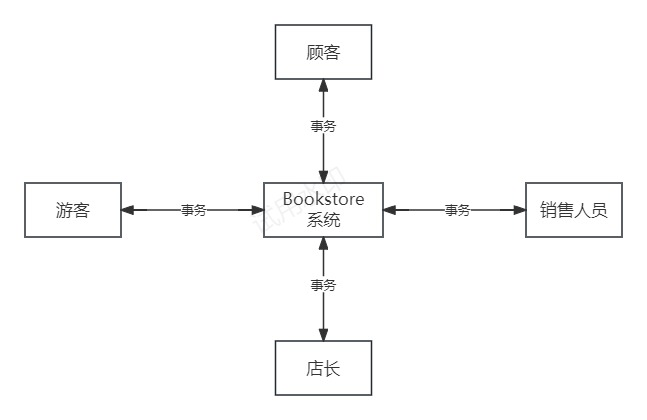
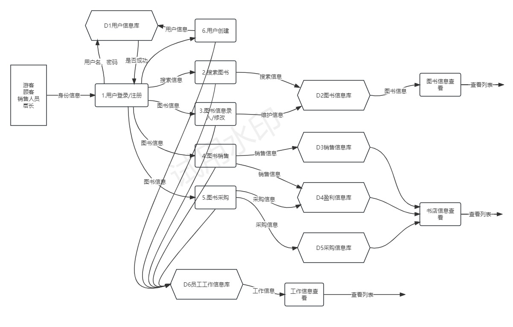

# 大作业Bookstore的需求分析文档
## 1. 系统功能概述

    1.查询图书：通过 ISBN 号、作者名字、关键字、书名进行搜素显示结果列表。
	2.购买图书：通过给定的 ISBN 号和购买数量，进行购买
	3.图书进购：采购图书，并更新已有图书。
	4.图书信息录入与修改：维护图书信息
	5.店长查询：查询查询某段时间的采购信息、销售情况、盈利信息，工作情况报告、系统的整体工作日志。

## 2. 功能需求
Bookstore的顶层数据流图

描述：如图1所示，用户可以扮演四种角色——游客、顾客、销售人员和店长。无论用户扮演何种角色，可以向 Bookstore 系统发送事务，同时可以浏览 Bookstore 系统返回的事务，即用户与 Bookstore 系统有双向的数据流动。
Bookstore 的0层数据流图

